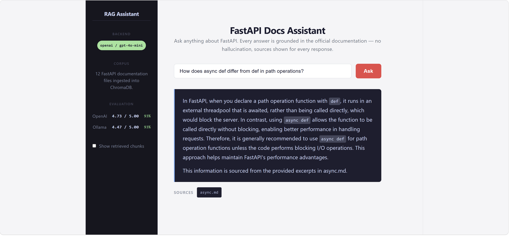

# RAG Assistant

A modular Retrieval-Augmented Generation (RAG) system that answers questions grounded in FastAPI documentation. Designed with a backend-agnostic architecture that supports both cloud LLMs (OpenAI) and fully local, offline models (phi3:mini via Ollama) — swapping backends requires changing one environment variable.



---

## What it does

Ask a question about FastAPI. The system retrieves the most relevant chunks from the ingested documentation using vector similarity search, injects them as context into the LLM prompt, and returns a grounded answer with source attribution — no hallucination, every answer traceable to a specific document.

---

## Architecture

```
data/raw/*.md
      │
      ▼
document_loader.py    →   reads markdown files into Document objects
      │
      ▼
chunker.py            →   boundary-aware splitting into overlapping chunks
      │
      ▼
embedder.py           →   OpenAI text-embedding-3-small → ChromaDB (local disk)
      │
      ▼  (at query time)
embedder.py           →   embeds the question, queries ChromaDB for top-K chunks
      │
      ▼
llm_client.py         →   ONLY file that knows which LLM backend is active
      │
      ▼
pipeline.py           →   { answer, sources, chunks }
      │
      ▼
scripts/cli.py        →   interactive CLI
app.py                →   Streamlit web UI
```

**Key design decision:** `llm_client.py` is the only module that knows whether the system is using OpenAI or Ollama. Everything else is backend-agnostic. Changing `LLM_BACKEND` in `.env` is the only change required to swap models.

---

## Tech Stack

| Component | Choice | Why |
|---|---|---|
| Vector store | ChromaDB | Local disk persistence, no API key, offline-capable |
| Embeddings | OpenAI `text-embedding-3-small` | Multilingual, high quality, low cost |
| Generation (default) | OpenAI `gpt-4o-mini` | Fast, cheap, strong instruction following |
| Generation (local) | phi3:mini via Ollama | Fully offline, zero API cost, CPU-runnable |
| Chunking | Boundary-aware (paragraph → sentence fallback) | Avoids cutting mid-sentence |
| UI | React + Vite | Clean, responsive frontend |
| API | FastAPI | REST backend wrapping the RAG pipeline |
| Query rewriting | GPT-4o-mini pre-retrieval | Improves semantic match between questions and docs |

---

## Corpus

12 FastAPI official documentation files ingested from the FastAPI GitHub repository:

`alternatives.md` · `async.md` · `benchmarks.md` · `editor-support.md` · `environment-variables.md` · `fastapi-cli.md` · `features.md` · `history-design-future.md` · `index.md` · `project-generation.md` · `python-types.md` · `virtual-environments.md`

364 chunks total after boundary-aware splitting (CHUNK_SIZE=800, CHUNK_OVERLAP=150).

---

## Evaluation

Evaluated on 15 question/reference-answer pairs using an **LLM-as-judge** methodology — GPT-4o-mini scores each generated answer 1–5 against the reference at temperature=0 for consistent scoring.

| Backend | Avg Score | Median | Score ≥ 4 | Failures |
|---|---|---|---|---|
| OpenAI gpt-4o-mini | 4.73 / 5.00 | 5.0 | 14/15 (93%) | 0 |
| Ollama phi3:mini | 4.47 / 5.00 | 5.0 | 14/15 (93%) | 0 |

The local model achieved comparable answer quality to the cloud model while running fully offline with zero API cost, at the tradeoff of significantly higher latency on CPU-only hardware (~30–60s per response without a GPU).

Query rewriting is applied before retrieval to close the semantic gap between conversational questions and documentation prose. This improved average eval score from 4.27 to 4.73 and eliminated all retrieval failures.

---

## Project Structure

```
rag-assistant/
├── rag/                      # Core library
│   ├── config.py             # Central config loaded from .env
│   ├── document_loader.py    # Markdown files → Document objects
│   ├── chunker.py            # Documents → overlapping Chunk objects
│   ├── embedder.py           # Chunks → embeddings → ChromaDB
│   ├── llm_client.py         # LLM abstraction (OpenAI or Ollama)
│   ├── query_rewriter.py     # Pre-retrieval query rewriting
│   └── pipeline.py           # Wires components into ask()
├── api/
│   └── main.py               # FastAPI REST backend
├── frontend/
│   └── src/
│       ├── App.jsx           # React frontend
│       └── App.css           # Styles
├── scripts/
│   └── cli.py                # Interactive CLI
├── evaluation/
│   ├── eval_set.json         # 15 Q&A pairs
│   └── evaluate.py           # LLM-as-judge evaluation script
├── data/
│   └── raw/                  # Source markdown files
├── app.py                    # Streamlit UI (Phase 3)
├── .env.example
├── requirements.txt
└── README.md
```

---

## Quickstart

```bash
# 1. Clone and set up environment
git clone https://github.com/sharif-hassan/rag-assistant.git
cd rag-assistant
python -m venv .venv

# Windows:
.venv\Scripts\activate
# Mac/Linux:
source .venv/bin/activate

pip install -r requirements.txt

# 2. Configure
cp .env.example .env
# Edit .env and set OPENAI_API_KEY

# 3. Ingest documents into ChromaDB
python -m rag.embedder

# 4. Run the FastAPI backend
uvicorn api.main:app --reload

# 5. In a separate terminal, run the React frontend
cd frontend
npm install
npm run dev

# Or use the CLI
python -m scripts.cli

# Or use the Streamlit UI (simpler, no separate frontend needed)
streamlit run app.py
```

### Switching to local/offline mode

Install [Ollama](https://ollama.com/download), pull a model, then change one line in `.env`:

```bash
ollama pull phi3:mini
```

```env
LLM_BACKEND=ollama
OLLAMA_MODEL=phi3:mini
```

No other changes required.

### Running evaluation

```bash
# OpenAI backend
python -m evaluation.evaluate openai

# Ollama backend
python -m evaluation.evaluate ollama
```

---

## Design Principles

1. **Backend-agnostic core** — `llm_client.py` is the only file that knows which LLM is active
2. **Offline-capable** — ChromaDB persists to local disk; Ollama runs with no internet or API key
3. **Source attribution** — every answer includes which documents it was grounded in
4. **Incremental architecture** — each phase (CLI → eval → UI → web app) is independently valuable
